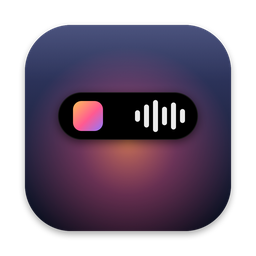
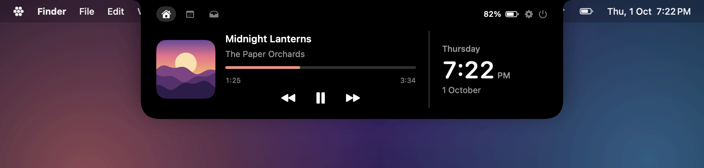
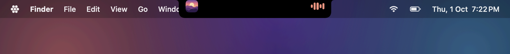
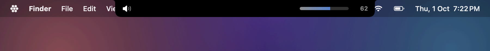
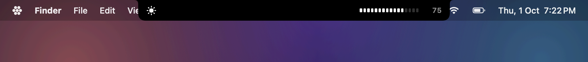
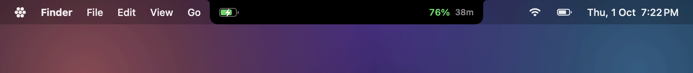
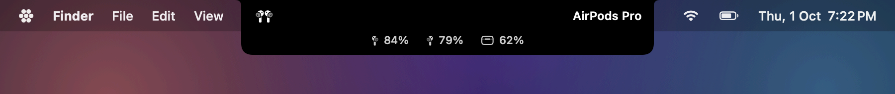
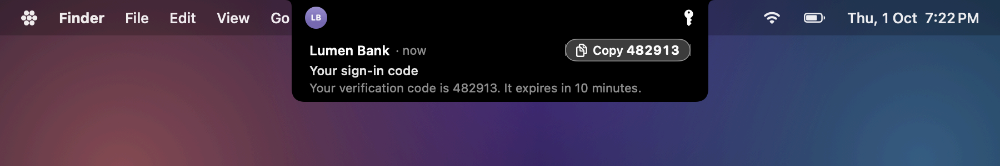
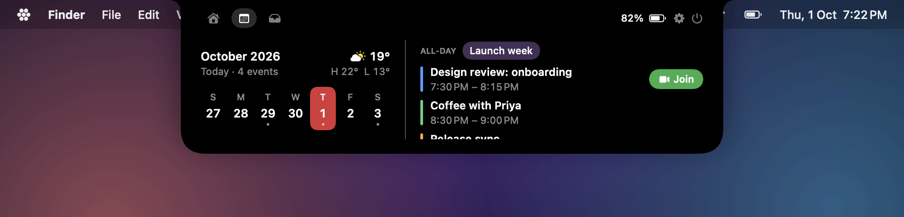
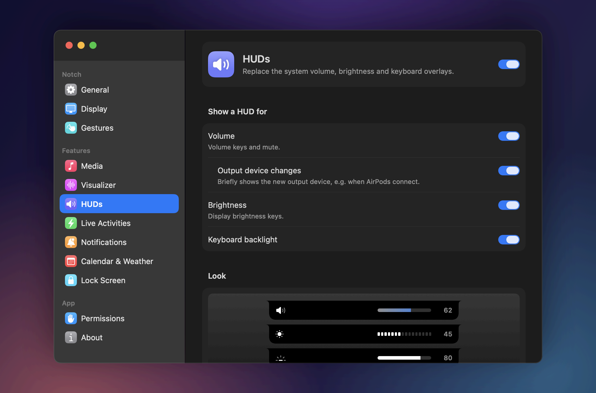

<p align="center">
  
</p>

<h1 align="center">Perch</h1>

<p align="center">Turns the MacBook notch into a live, interactive island for music, HUDs, alerts and your day.</p>

<p align="center">
  
</p>

## Features

**Media**: Now Playing from any app, browsers included. Artwork, title, artist, a seekable progress bar and playback controls, with optional shuffle, repeat and like buttons. Artwork styles are full color, gradient backdrop or mono. The player can take its tint from the artwork. When closed, the notch shows the artwork and a live audio visualizer.

**HUDs**: replaces the system volume, brightness and keyboard backlight overlays. Six bar styles. Per-HUD rules for the lock screen and Focus. Brightness keys also work on external displays (DDC on Apple Silicon).

**Live Activities**: charging and unplugging with time remaining, low battery, Low Power Mode, Focus changes, track changes, and Bluetooth devices connecting with their battery level (AirPods show left, right and case). Swipe sideways on the closed notch to cycle through recent activities.

**Notifications**: mirrors delivered notifications into the notch, from email apps or from apps you choose. Bursts are grouped. One-time codes get a **Copy** button.

**Calendar & Weather**: a week strip with the day's events, or an agenda view. Meeting alerts with a Join button, time-to-leave, an optional hourly chime, and today's forecast from Open-Meteo.

**Lock Screen**: Now Playing, battery, weather, next event and Bluetooth widgets on the lock screen. Can also show over the screensaver.

**Gestures**: on the closed notch, swipe down to open, swipe up to dismiss an activity, and swipe sideways to cycle activities or skip tracks. On the open notch, swipe up to close and swipe sideways to switch tabs.

**Shelf**: drop files on the notch to hold them for later. Drag them back out, or double-click to open.

**Settings**: a searchable, System Settings-style window. You can choose which displays show the notch (or a simulated notch on displays without one), its size, and whether it hides in fullscreen apps, games, Mission Control and screen recordings. Also: launch at login and a menu bar icon.

| | |
|---|---|
|  |  |
|  |  |
|  |  |

<p align="center">
  
</p>

<p align="center">
  
</p>

## Requirements

- macOS 14 Sonoma or later (the live audio visualizer needs 14.4+)
- Apple Silicon or Intel Mac. Displays without a notch can show a simulated one.
- Xcode Command Line Tools (`xcode-select --install`). The full Xcode app isn't needed.

## Build and install

```sh
git clone https://github.com/d4nuux/perch.git
cd perch
./build.sh            # builds build/Perch.app
./build.sh --run      # builds and launches it from ./build
./build.sh --install  # builds, copies to /Applications and launches it
```

### Optional: a stable signing identity

macOS ties privacy permissions (Accessibility, Calendars, etc.) to the app's code signature. An ad-hoc signature changes on every build, so each rebuild loses its grants. If a certificate named **`NotchApp Local Signing`** is in your keychain, `build.sh` signs with it, and permissions survive rebuilds.

To create the certificate once:

1. Open **Keychain Access**, then choose **Keychain Access > Certificate Assistant > Create a Certificate…**
2. Name: `NotchApp Local Signing`. Identity Type: **Self-Signed Root**. Certificate Type: **Code Signing**. Click **Create**.
3. Check that it's there: `security find-certificate -c "NotchApp Local Signing"`
4. Run `./build.sh` again. The first time `codesign` uses the key, choose **Always Allow**.

If you already granted permissions to an ad-hoc build, remove Perch from those lists in System Settings and grant them again.

## Permissions

Perch asks for each permission only when a feature needs it. **Settings > Permissions** shows the status of each one.

| Permission | Used for |
|---|---|
| Accessibility | Intercepting volume, brightness and keyboard backlight keys for the HUDs. Also used to detect Mission Control. |
| Calendars | Events in the Calendar tab, meeting alerts and the lock-screen next-event widget |
| Bluetooth | Device connect alerts with battery levels |
| Location | Local weather and time-to-leave. You can set a city manually instead. |
| System Audio Recording | The live visualizer (audio levels only, nothing is recorded to disk) |
| Full Disk Access (optional) | Reading the system notification database to mirror notifications |
| Automation | Controlling Music and Spotify over AppleScript (fallback source, shuffle/repeat/like) |

## URL scheme

`perch://` URLs work from Terminal (`open perch://open/calendar`), Shortcuts or any launcher.

| URL | Action |
|---|---|
| `perch://open` | Open the notch |
| `perch://open/home`, `/calendar`, `/shelf` | Open on a specific tab |
| `perch://close` | Close the notch |
| `perch://settings` | Open Settings |
| `perch://settings/<pane>` | Open a pane: `general`, `display`, `media`, `visualizer`, `huds`, `activities`, `notifications`, `calendar`, `lockscreen`, `gestures`, `permissions`, `about` |
| `perch://onboarding` | Show the welcome window again |

## Notes

Perch uses private macOS frameworks, so it can't ship on the App Store and may break with a macOS update:

- **MediaRemote** for system-wide Now Playing. Recent macOS versions only let entitled processes read it, so a small helper dylib is loaded into `/usr/bin/perl` (`Helper/`).
- **SkyLight** to place widgets on the lock screen.
- **DisplayServices / CoreBrightness** for the built-in display and keyboard backlight brightness.

Each one is loaded at runtime. If a symbol is missing, that feature turns itself off and the rest of the app keeps working.

## Project layout

```
Sources/Perch/
  Core/           app entry, NotchModel, NotchController (panels), live activity model
  UI/             NotchView: shape, expanded tabs, header
  Display/        screens, simulated notch, fullscreen / Mission Control hiding
  Media/          Now Playing, player, artwork color, visualizer (Waveform/)
  HUD/            media key tap, volume/brightness/backlight, HUD views
  Activities/     battery, Bluetooth, Focus, track-change activities
  Notifications/  notification DB reader, mirroring, views
  Calendar/       EventKit service, Calendar tab, alerts, time-to-leave
  Weather/        Open-Meteo client, location
  LockScreen/     SkyLight bridge, lock-screen widgets
  Settings/       Settings window, permissions, onboarding, URL scheme, gestures
  System/         battery reader, shelf
Helper/           MediaRemote helper (Objective-C dylib + perl host script)
Resources/        app icon
tools/            make-icon.swift (regenerates the icon), screenshots/ (renders docs/images with fake data)
build.sh          build, bundle, sign, run/install
```

## License

MIT. See [LICENSE](LICENSE).
